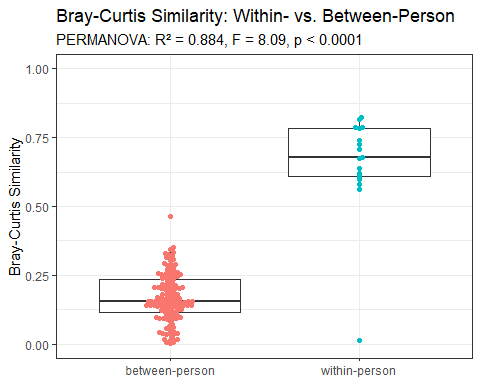

Power simulation and misc analyses for grant
================

## Power simulation

- To project statistical power for the primary analysis (the ETI ×
  capacity score interaction) at the anticipated evaluable sample size,
  we conducted a Monte Carlo power simulation with 20,000 replicates per
  scenario
  - Each replicate simulated a dataset under the assumed data-generating
    model:
    - A reduced model (ETI, capacity score, and **6 covariates**)
      explaining R² = 0.20 of outcome variance,
    - The ETI x capacity interaction term targeting an incremental
      effect size of f² = 0.029 (approximately ΔR² = 0.023)
    - Power was defined as the proportion of replicates in which the
      interaction term was statistically significant using HC3 robust
      standard errors
- Power was estimated under three capacity-sampling modes
  - Resampling directly from the observed empirical distribution (900
    values)
  - A winsorized version (1st/99th percentile trimmed) to check
    sensitivity to potential outliers
  - A normal approximation matched to the empirical mean and SD
- The table below reflects the **uncorrelated** scenario, with ETI and
  capacity score treated as statistically independent
  - ETI-SR was simulated as an independent standard normal in this
    uncorrelated scenario, consistent with the assumption of no
    association between dietary/behavioral exposure and capacity score
  - At the projected evaluable sample size of N = 328, power exceeded
    80% across all three capacity-sampling modes
  - At the accrual-shortfall contingencies (N=300 and N=270), power
    falls to 77.0–79.2% and 72.2–74.4% respectively

|  N  | Mode            | Target f² | Power |  MCSE   |
|:---:|:----------------|:---------:|:-----:|:-------:|
| 328 | empirical       |   0.029   | 81.2% | 0.28 pp |
| 328 | winsorized_1_99 |   0.029   | 82.6% | 0.27 pp |
| 328 | normal          |   0.029   | 82.9% | 0.27 pp |
| 300 | empirical       |   0.029   | 77.0% | 0.30 pp |
| 300 | winsorized_1_99 |   0.029   | 78.8% | 0.29 pp |
| 300 | normal          |   0.029   | 79.2% | 0.29 pp |
| 270 | empirical       |   0.029   | 72.2% | 0.32 pp |
| 270 | winsorized_1_99 |   0.029   | 74.0% | 0.31 pp |
| 270 | normal          |   0.029   | 74.4% | 0.31 pp |

- To evaluate robustness to a plausible **correlation structure** among
  predictors, we repeated the simulation using a Gaussian copula to
  induce dependence between ETI-SR, capacity score, and age, while
  preserving each variable’s observed marginal distribution
  - Both ETI-SR and capacity score were resampled from their observed
    empirical distributions via the copula’s quantile transform:
    $X_i = \hat{Q}_X(u_i)$, where $u_i$ is the copula-transformed
    uniform variate and $\hat{Q}_X$ is the empirical quantile function
    for ETI-SR (n = 257) or capacity score (n = 900)
  - The correlation between capacity score and age ($\rho = 0.043$) was
    fixed at its observed (anchored) value throughout
  - The correlation between ETI-SR and capacity score was varied across
    $\rho \in \lbrace-0.15, 0, 0.15\rbrace$, and between capacity score
    and fiber intake across $\rho \in \lbrace0, 0.20, 0.40\rbrace$,
    yielding a 3×3 grid of correlation scenarios
  - This grid was evaluated at all three sample sizes (N = 328, 300,
    270), for 27 scenarios total, each with 20,000 replicates
- Power was largely insensitive to the capacity–fiber correlation (≤1 pp
  shift across ρ = 0–0.40 at any fixed N and ETI–capacity correlation)
  - Power was more sensitive to the direction of the ETI–capacity
    correlation: a negative correlation (ρ = −0.15) increased power by
    roughly 3 pp relative to independence, while a positive correlation
    (ρ = 0.15) decreased power by roughly 3–4 pp, at every sample size
    evaluated
  - Across the full correlated grid, power at the primary sample size (N
    = 328) ranged from 77.3% to 84.1%. At the accrual-shortfall sample
    sizes, the lowest observed power was 67.9-68.3% (N = 270, positive
    ETI–capacity correlation)

|  N  | ρ (ETI–capacity) | ρ (capacity–fiber) | Target f² | Power |  MCSE   |
|:---:|:----------------:|:------------------:|:---------:|:-----:|:-------:|
| 328 |      -0.15       |        0.0         |   0.029   | 83.3% | 0.26 pp |
| 328 |      -0.15       |        0.2         |   0.029   | 84.1% | 0.26 pp |
| 328 |      -0.15       |        0.4         |   0.029   | 84.0% | 0.26 pp |
| 328 |       0.00       |        0.0         |   0.029   | 80.9% | 0.28 pp |
| 328 |       0.00       |        0.2         |   0.029   | 80.7% | 0.28 pp |
| 328 |       0.00       |        0.4         |   0.029   | 81.0% | 0.28 pp |
| 328 |       0.15       |        0.0         |   0.029   | 77.6% | 0.29 pp |
| 328 |       0.15       |        0.2         |   0.029   | 77.3% | 0.30 pp |
| 328 |       0.15       |        0.4         |   0.029   | 77.3% | 0.30 pp |
| 300 |      -0.15       |        0.0         |   0.029   | 80.0% | 0.28 pp |
| 300 |      -0.15       |        0.2         |   0.029   | 79.9% | 0.28 pp |
| 300 |      -0.15       |        0.4         |   0.029   | 80.5% | 0.28 pp |
| 300 |       0.00       |        0.0         |   0.029   | 77.4% | 0.30 pp |
| 300 |       0.00       |        0.2         |   0.029   | 76.5% | 0.30 pp |
| 300 |       0.00       |        0.4         |   0.029   | 76.8% | 0.30 pp |
| 300 |       0.15       |        0.0         |   0.029   | 73.6% | 0.31 pp |
| 300 |       0.15       |        0.2         |   0.029   | 73.8% | 0.31 pp |
| 300 |       0.15       |        0.4         |   0.029   | 73.4% | 0.31 pp |
| 270 |      -0.15       |        0.0         |   0.029   | 75.5% | 0.30 pp |
| 270 |      -0.15       |        0.2         |   0.029   | 75.6% | 0.30 pp |
| 270 |      -0.15       |        0.4         |   0.029   | 75.6% | 0.30 pp |
| 270 |       0.00       |        0.0         |   0.029   | 71.5% | 0.32 pp |
| 270 |       0.00       |        0.2         |   0.029   | 71.9% | 0.32 pp |
| 270 |       0.00       |        0.4         |   0.029   | 72.2% | 0.32 pp |
| 270 |       0.15       |        0.0         |   0.029   | 68.2% | 0.33 pp |
| 270 |       0.15       |        0.2         |   0.029   | 68.3% | 0.33 pp |
| 270 |       0.15       |        0.4         |   0.029   | 67.9% | 0.33 pp |

## MAC 16S secondary analyses

### Intra-class correlation on Shannon Index

- A two-way, absolute-agreement, single-measure intraclass correlation
  coefficient (ICC) was calculated to assess test-retest reliability of
  the Shannon diversity index, comparing values measured at baseline and
  at the end of the control phase among participants in the control-mac
  sequence group

- The ICC was 0.954 (95% CI: 0.878–0.983; p \< 0.0001), indicating
  excellent test-retest reliability

  - This suggests that overall gut microbial community diversity, as
    summarized by the Shannon index, remained highly stable within
    individuals over the course of the control phase, supporting its use
    as a reproducible, individual-level measure of diversity in this
    cohort.

| Subjects | Raters | ICC(A,1) |    95% CI    |  F   | df1 | df2 | p-value  |
|:--------:|:------:|:--------:|:------------:|:----:|:---:|:---:|:--------:|
|    17    |   2    |  0.954   | 0.878, 0.983 | 40.3 | 16  | 16  | \< 0.001 |

### Bray-Curtis similarity, within- vs between-person

- To evaluate compositional reliability, we calculated Bray-Curtis
  similarity between all pairs of stool samples collected from
  participants in the control-first (control-mac) sequence group, based
  on relative abundance across 4,166 taxa

  - Similarity values range from 0 (no shared taxa) to 1 (identical
    composition), with higher values indicating greater compositional
    similarity between two samples.

- For each of the 17 participants in the control-first group, we
  compared the baseline sample to the end-of-control-phase sample,
  yielding 17 within-person similarity values

- Between-person similarity was calculated from all pairwise
  combinations of the 17 baseline samples across different participants,
  yielding $\binom{17}{2} = 136$ between-person similarity values.
  Summary statistics for both groups are shown below

| Group          |  N  | Mean  |  SD   | Median |  Q1   |  Q3   |
|:---------------|:---:|:-----:|:-----:|:------:|:-----:|:-----:|
| Between-person | 136 | 0.169 | 0.088 | 0.157  | 0.114 | 0.234 |
| Within-person  | 17  | 0.655 | 0.186 | 0.679  | 0.607 | 0.784 |

- Within-person similarity (mean = 0.655, median = 0.679) was
  substantially higher than between-person similarity (mean = 0.169,
  median = 0.157)
  - indicating that an individual’s gut microbial composition remained
    far more similar to itself over time than to another participant’s
    composition at a single timepoint
- This difference was confirmed formally using permutation MANOVA
  (PERMANOVA with 9999 permutations), testing whether subject ID
  explained variation in pairwise Bray-Curtis dissimilarity
  - Subject effect accounted for 88.4% of the total variance
    ($R^2 = 0.884$, $p < 0.0001$), providing strong statistical support
    for within-person compositional stability substantially exceeding
    between-person variability in this cohort

<!-- -->

### Roseburia zero-inflation

- There are 11 of 35 participants (31.4%) with Roseburia_2 = 0 in both
  phases, and 6 more participants (17.1%) with Roseburia_2 = 0 in only
  one of the two phases – bringing the total to 17 of 35 participants
  (49%) with at least one zero value
