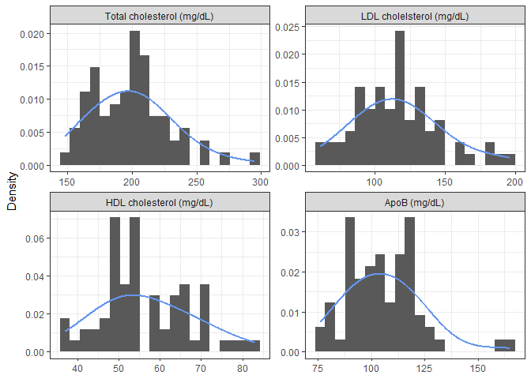
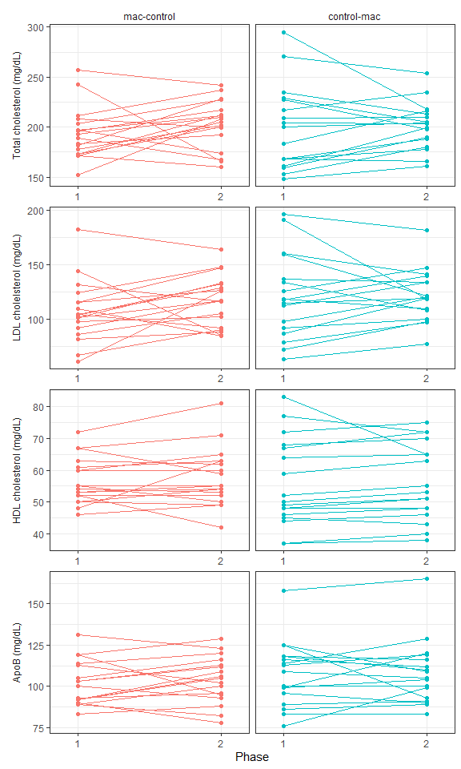
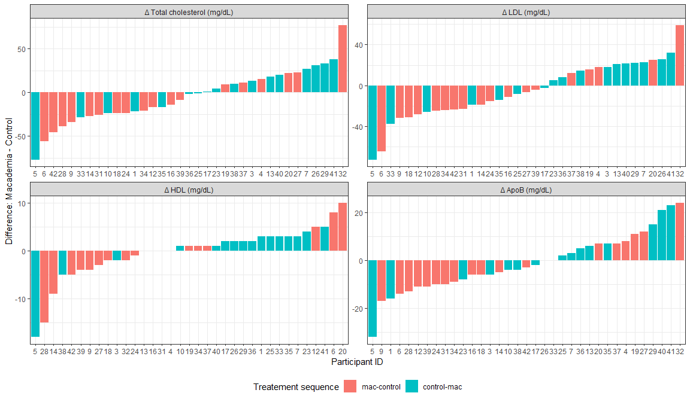
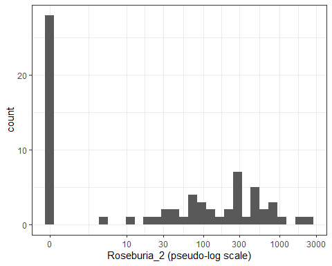
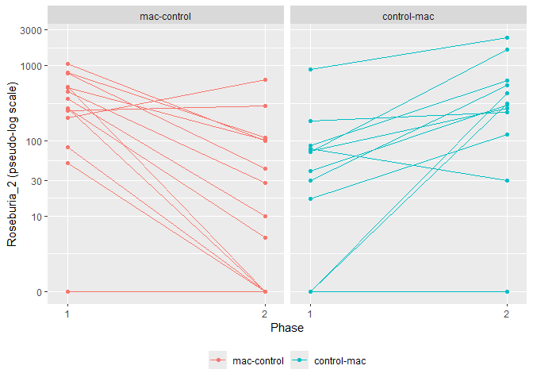
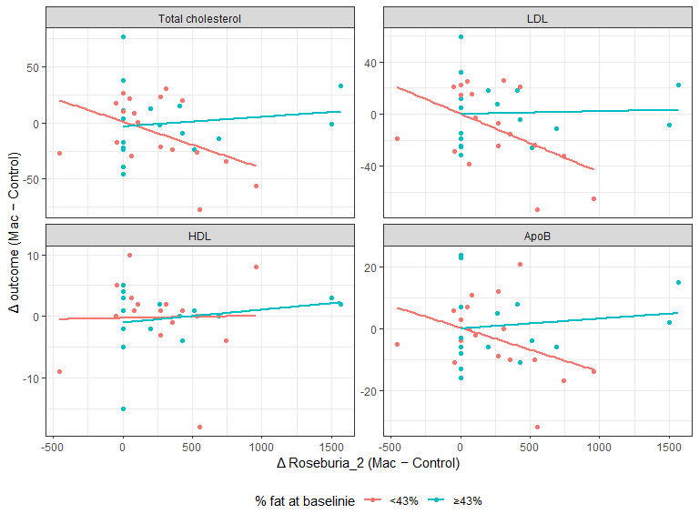

MAC Microbiome Study
================

## Datasets

- Data are from a 2 x 2 crossover design (AB/BA) with control/mac
  treatments ([Jones et al., 2023](https://doi.org/10.1017/jns.2023.39))

- Anthropometric data

  - Excel file `MAC Anthropometric data.xlsx`
  - Wide-format data for 35 unique participant IDs
  - Includes **BMI** and **percent body fat** (at `visit 0`, `clinic 4`,
    and `clinic 9`)
    - Also includes: weight (kg) and waist circumference (cm)

- Cardiometabolic data

  - Excel file `LLU_MAC Study_cardiometabolic outcomes.xlsx`
  - Long-format data for 38 unique participant IDs
    - Baseline (visit 0), Phase 1 (visit 4), Phase 2 (visit 9), and
      clinic date
  - Includes **total cholesterol**, **LDL**, **HDL**, and **ApoB**
    - Also includes: glucose, insulin, triglycerides, VLDL, ApoA1, CRP,
      and E-selectin

- Microbiome data

  - Excel file `human_mac_study_abundance_data.xls`
  - Wide-format data with 4,166 bacteria species/ASVs, including
    **Roseburia**
  - The first 7 columns are: `Domain`, `Phylum`, `Class`, `Order`,
    `Family`, `Genus`, and `Species`
  - Abundance values at visits 0, 4, and 9 are stored in the 105 columns
    that follow, named:
    - MAC\[*ID_in_2digits*\]\_p1\[*v0/v4/v9*\]

- To extract participants’ treatment sequence, use:

  - SPSS data file `MAC Endpoint data with baseline values 102121.sav`
  - Participant characteristics were also extracted from this file
    - Sex, age at baseline, and weight at baseline

- Data files were merged to produce a long-format dataset

  - 105 observations (3 visits, including baseline, × 35 participants)

## Descriptive table at baseline

- Descriptive statistics at baseline by sequence
  - \[**Need to check**\] Descriptive statistics on percent body fat are
    slightly off, compared to the original paper ([Jones et al.,
    2023](https://doi.org/10.1017/jns.2023.39))

<table style="NAborder-bottom: 0;">

<thead>

<tr>

<th style="text-align:left;">

Characteristic
</th>

<th style="text-align:center;">

Overall  N = 35
</th>

<th style="text-align:center;">

mac-control  N = 18
</th>

<th style="text-align:center;">

control-mac  N = 17
</th>

<th style="text-align:center;">

p-value
</th>

</tr>

</thead>

<tbody>

<tr>

<td style="text-align:left;">

Age (years)
</td>

<td style="text-align:center;">

61.7 (8.3)
</td>

<td style="text-align:center;">

62.4 (7.8)
</td>

<td style="text-align:center;">

61.0 (9.1)
</td>

<td style="text-align:center;">

0.6313
</td>

</tr>

<tr>

<td style="text-align:left;">

Sex
</td>

<td style="text-align:center;">

</td>

<td style="text-align:center;">

</td>

<td style="text-align:center;">

</td>

<td style="text-align:center;">

0.6906
</td>

</tr>

<tr>

<td style="text-align:left;padding-left: 2em;" indentlevel="1">

F
</td>

<td style="text-align:center;">

28 (80%)
</td>

<td style="text-align:center;">

15 (83%)
</td>

<td style="text-align:center;">

13 (76%)
</td>

<td style="text-align:center;">

</td>

</tr>

<tr>

<td style="text-align:left;padding-left: 2em;" indentlevel="1">

M
</td>

<td style="text-align:center;">

7 (20%)
</td>

<td style="text-align:center;">

3 (17%)
</td>

<td style="text-align:center;">

4 (24%)
</td>

<td style="text-align:center;">

</td>

</tr>

<tr>

<td style="text-align:left;">

Weight (kg)
</td>

<td style="text-align:center;">

83.3 (14.1)
</td>

<td style="text-align:center;">

84.5 (14.7)
</td>

<td style="text-align:center;">

82.0 (13.7)
</td>

<td style="text-align:center;">

0.6069
</td>

</tr>

<tr>

<td style="text-align:left;">

BMI (kg/m²)
</td>

<td style="text-align:center;">

30.3 (3.4)
</td>

<td style="text-align:center;">

30.2 (3.7)
</td>

<td style="text-align:center;">

30.4 (3.3)
</td>

<td style="text-align:center;">

0.9050
</td>

</tr>

<tr>

<td style="text-align:left;">

Body fat (%)
</td>

<td style="text-align:center;">

42.3 (5.8)
</td>

<td style="text-align:center;">

41.8 (5.5)
</td>

<td style="text-align:center;">

42.8 (6.2)
</td>

<td style="text-align:center;">

0.6122
</td>

</tr>

<tr>

<td style="text-align:left;">

Total cholesterol (mg/dL)
</td>

<td style="text-align:center;">

204.2 (29.6)
</td>

<td style="text-align:center;">

199.2 (29.4)
</td>

<td style="text-align:center;">

209.5 (29.9)
</td>

<td style="text-align:center;">

0.3138
</td>

</tr>

<tr>

<td style="text-align:left;">

LDL cholesterol (mg/dL)
</td>

<td style="text-align:center;">

121.0 (27.7)
</td>

<td style="text-align:center;">

114.6 (27.5)
</td>

<td style="text-align:center;">

127.8 (27.1)
</td>

<td style="text-align:center;">

0.1614
</td>

</tr>

<tr>

<td style="text-align:left;">

HDL cholesterol (mg/dL)
</td>

<td style="text-align:center;">

56.8 (11.4)
</td>

<td style="text-align:center;">

56.7 (9.3)
</td>

<td style="text-align:center;">

56.9 (13.7)
</td>

<td style="text-align:center;">

0.9453
</td>

</tr>

<tr>

<td style="text-align:left;">

ApoB (mg/dL)
</td>

<td style="text-align:center;">

104.9 (16.8)
</td>

<td style="text-align:center;">

101.9 (16.4)
</td>

<td style="text-align:center;">

108.0 (17.2)
</td>

<td style="text-align:center;">

0.2946
</td>

</tr>

</tbody>

<tfoot>

<tr>

<td style="padding: 0; " colspan="100%">

 Values are mean (SD) for continuous variables and n (%) for
categorical variables. P-values from Welch’s two-sample t-test
(continuous) or Fisher’s exact test (categorical).
</td>

</tr>

</tfoot>

</table>

## Exploratory analyses

### Cardiometabolic variables

- Distributions of cardiometabolic measurements (excluding baseline)

<!-- -->

- Profile plots of cardiometabolic measurements by sequence
  - Each line represents a participant
  - Visualize individual-level change across phases
    - All within-person changes across phases fall within a
      physiologically plausible range

<!-- -->

- Waterfall plots of within-person change (mac − control) across four
  cardiometabolic outcomes
  - Each bar represents one participant’s change score, sorted from most
    negative to most positive
  - Visualize the direction and magnitude of individual treatment
    response, and whether response is consistent across the cohort or
    driven by a subset of participants

<!-- -->

- Mean (SD) within-person change (mac − control) for total cholesterol,
  LDL, HDL, and ApoB

| Outcome                   |     Mac      |   Control    | Δ (Mac-Control) |
|:--------------------------|:------------:|:------------:|:---------------:|
| Total cholesterol (mg/dL) | 197.0 (24.6) | 201.5 (33.7) |   -4.5 (30.4)   |
| LDL cholesterol (mg/dL)   | 114.0 (26.7) | 118.9 (31.5) |   -4.9 (27.9)   |
| HDL cholesterol (mg/dL)   |  56.4 (9.7)  | 56.7 (11.5)  |   -0.3 (5.5)    |
| ApoB (mg/dL)              | 105.0 (16.6) | 106.0 (17.0) |   -1.0 (12.1)   |

### Microbiome variables

- Only focusing on **Roseburia_2** for now. See the distribution below,
  excluding baseline:
  - The x-axis is on the pseudo-log scale
  - Note that there are \>25 zero counts

<!-- -->

- There are 11 participants with **Roseburia_2** = 0 in both phases
- Six participants have **Roseburia_2 = 0** in only one of the two
  phases
  - Incidentally, in all six cases, the zero occurred under the control
    treatment, not the macadamia treatment

<table class="kable_wrapper">

<tbody>

<tr>

<td>

|  id | group_lab   | phase_1 | phase_2 |
|----:|:------------|--------:|--------:|
|   1 | control-mac |       0 |       0 |
|   7 | control-mac |       0 |       0 |
|  18 | mac-control |       0 |       0 |
|  23 | control-mac |       0 |       0 |
|  28 | mac-control |       0 |       0 |
|  32 | mac-control |       0 |       0 |
|  35 | control-mac |       0 |       0 |
|  37 | mac-control |       0 |       0 |
|  38 | control-mac |       0 |       0 |
|  41 | control-mac |       0 |       0 |
|  42 | mac-control |       0 |       0 |

Zero in both phases

</td>

<td>

|  id | group_lab   | phase_1 | phase_2 |
|----:|:------------|--------:|--------:|
|  19 | mac-control |      83 |       0 |
|  20 | mac-control |      51 |       0 |
|  26 | control-mac |       0 |     311 |
|  31 | mac-control |     530 |       0 |
|  34 | mac-control |     274 |       0 |
|  40 | control-mac |       0 |     427 |

Zero in one phase

</td>

</tr>

</tbody>

</table>

- Profile plots of **Roseburia_2** by sequence
  - Shows higher **Roseburia_2** abundance under the macadamia diet
  - The flat lines at zero correspond to the 11 participants with
    Roseburia_2 = 0 in both phases (see table above)
  - Note: the y-axis uses a pseudo-log scale to accommodate true zeros,
    so visual distances near the bottom of the axis are
    compressed/expanded non-linearly relative to distances higher up
    - A line rising from 0 shouldn’t be read as directly comparable in
      magnitude to, say, a line rising from 300 to 1000

<!-- -->

- Median (IQR) of **Roseburia_2** by treatment, presented here (rather
  than mean/SD or geometric mean) given the substantial zero-inflation
  in this variable (see zero-count table above)

| Mac, Median (IQR) | Control, Median (IQR) | Δ Roseburia_2 (Mac-Control) |
|:------------------|:----------------------|:----------------------------|
| 250.0 (483.5)     | 5.0 (75.5)            | 104.0 (427.0)               |

### Bivariate relationship with cardiometabolic measures

- To examine the association between Δ **Roseburia_2** and Δ total
  cholesterol, LDL, HDL, and ApoB, scatterplots were generated for each
  pair
  - Participants were split into two groups by the median baseline %
    body fat (\<43% and ≥43%), and a linear trend line was overlaid for
    each group
- In the scatterplots for Δ total cholesterol, LDL, and ApoB, slopes are
  visibly different between the two adiposity groups: a stronger
  negative association appears in the low adiposity group (\<43%), while
  the high adiposity group (≥43%) shows a slope close to flat
  - HDL shows little relationship with Δ Roseburia_2 in either group
- These patterns suggest that baseline %body fat may modify the
  association between Δ Roseburia_2 and these cardiometabolic outcomes

<!-- -->
