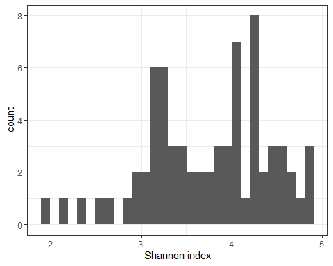
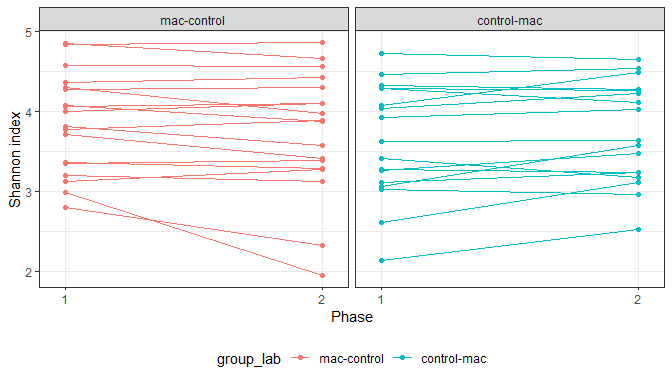
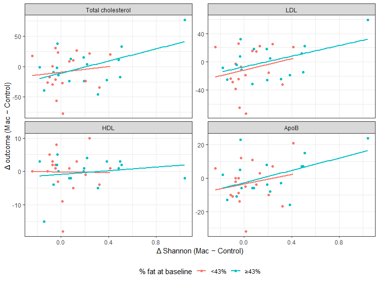
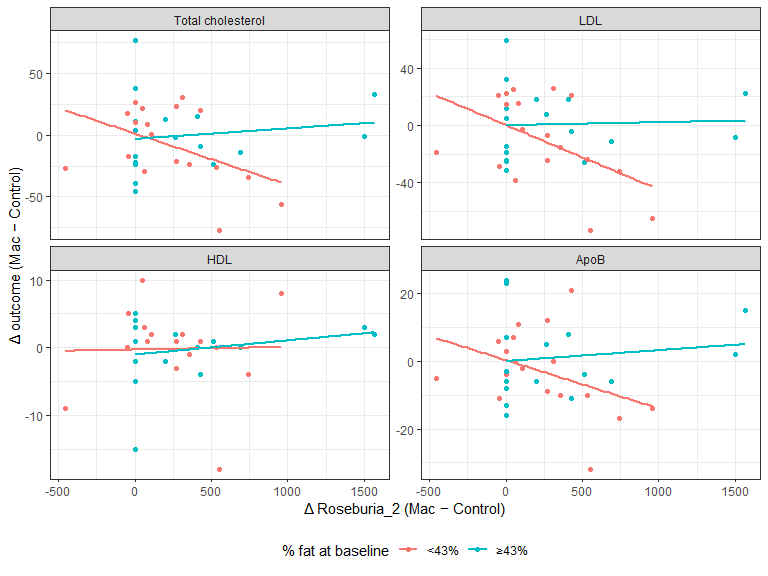
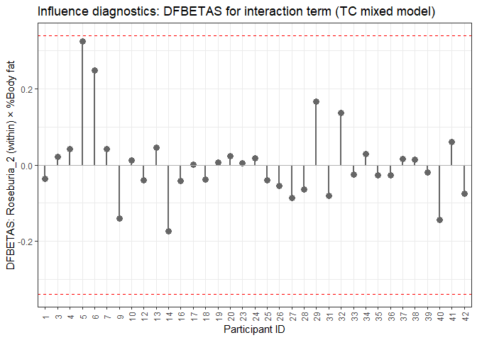
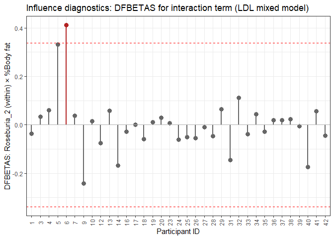
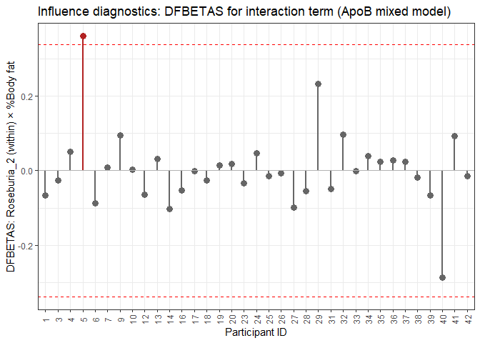
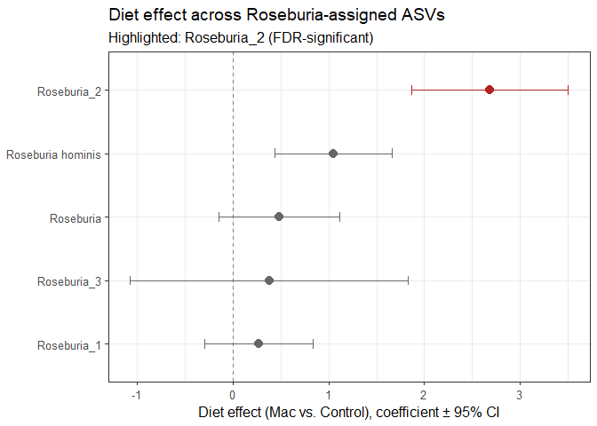
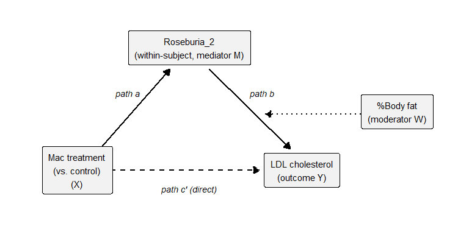

MAC Microbiome Study
================

## Datasets

- Data are from a 2 x 2 crossover design (AB/BA) with control/mac
  treatments ([Jones et al., 2023](https://doi.org/10.1017/jns.2023.39))

- Anthropometric data

  - Excel file `MAC Anthropometric data.xlsx`
  - Wide-format data for 35 unique participant IDs
  - Includes **BMI** and **percent body fat** (at `visit 0`, `clinic 4`,
    and `clinic 9`)
    - Also includes: weight (kg) and waist circumference (cm)

- Cardiometabolic data

  - Excel file `LLU_MAC Study_cardiometabolic outcomes.xlsx`
  - Long-format data for 38 unique participant IDs
    - Baseline (visit 0), Phase 1 (visit 4), Phase 2 (visit 9), and
      clinic date
  - Includes **total cholesterol**, **LDL**, **HDL**, and **ApoB**
    - Also includes: glucose, insulin, triglycerides, VLDL, ApoA1, CRP,
      and E-selectin

- Microbiome data

  - Excel file `human_mac_study_abundance_data.xls`
    - Wide-format data with 4,166 bacteria species/ASVs, including
      **Roseburia**
    - The first 7 columns are: `Domain`, `Phylum`, `Class`, `Order`,
      `Family`, `Genus`, and `Species`
    - Abundance values at visits 0, 4, and 9 are stored in the 105
      columns that follow, named:
      - MAC\[*ID_in_2digits*\]\_p1\[*v0/v4/v9*\]
  - CSV file `metadata_with_alpha_div_indices.csv`
    - Long-format data for 35 unique participant IDs (3 visits x 35 =
      105 observations)
    - Includes other diversity indices such as Simpson, Chao1, and
      observed (richness?)

- To extract participants’ treatment sequence, use:

  - SPSS data file `MAC Endpoint data with baseline values 102121.sav`
  - Participant characteristics were also extracted from this file
    - Sex, age at baseline, and weight at baseline

- Data files were merged to produce a long-format dataset

  - 105 observations (3 visits, including baseline, × 35 participants)

## Descriptive table at baseline

- Descriptive statistics at baseline by sequence
  - \[**Need to check**\] Descriptive statistics on percent body fat are
    slightly off, compared to the original paper ([Jones et al.,
    2023](https://doi.org/10.1017/jns.2023.39))

<table style="NAborder-bottom: 0;">

<thead>

<tr>

<th style="text-align:left;">

Characteristic
</th>

<th style="text-align:center;">

Overall  N = 35
</th>

<th style="text-align:center;">

mac-control  N = 18
</th>

<th style="text-align:center;">

control-mac  N = 17
</th>

<th style="text-align:center;">

p-value
</th>

</tr>

</thead>

<tbody>

<tr>

<td style="text-align:left;">

Age (years)
</td>

<td style="text-align:center;">

61.7 (8.3)
</td>

<td style="text-align:center;">

62.4 (7.8)
</td>

<td style="text-align:center;">

61.0 (9.1)
</td>

<td style="text-align:center;">

0.6313
</td>

</tr>

<tr>

<td style="text-align:left;">

Sex
</td>

<td style="text-align:center;">

</td>

<td style="text-align:center;">

</td>

<td style="text-align:center;">

</td>

<td style="text-align:center;">

0.6906
</td>

</tr>

<tr>

<td style="text-align:left;padding-left: 2em;" indentlevel="1">

F
</td>

<td style="text-align:center;">

28 (80%)
</td>

<td style="text-align:center;">

15 (83%)
</td>

<td style="text-align:center;">

13 (76%)
</td>

<td style="text-align:center;">

</td>

</tr>

<tr>

<td style="text-align:left;padding-left: 2em;" indentlevel="1">

M
</td>

<td style="text-align:center;">

7 (20%)
</td>

<td style="text-align:center;">

3 (17%)
</td>

<td style="text-align:center;">

4 (24%)
</td>

<td style="text-align:center;">

</td>

</tr>

<tr>

<td style="text-align:left;">

Weight (kg)
</td>

<td style="text-align:center;">

83.3 (14.1)
</td>

<td style="text-align:center;">

84.5 (14.7)
</td>

<td style="text-align:center;">

82.0 (13.7)
</td>

<td style="text-align:center;">

0.6069
</td>

</tr>

<tr>

<td style="text-align:left;">

BMI (kg/m²)
</td>

<td style="text-align:center;">

30.3 (3.4)
</td>

<td style="text-align:center;">

30.2 (3.7)
</td>

<td style="text-align:center;">

30.4 (3.3)
</td>

<td style="text-align:center;">

0.9050
</td>

</tr>

<tr>

<td style="text-align:left;">

Body fat (%)
</td>

<td style="text-align:center;">

42.3 (5.8)
</td>

<td style="text-align:center;">

41.8 (5.5)
</td>

<td style="text-align:center;">

42.8 (6.2)
</td>

<td style="text-align:center;">

0.6122
</td>

</tr>

<tr>

<td style="text-align:left;">

Total cholesterol (mg/dL)
</td>

<td style="text-align:center;">

204.2 (29.6)
</td>

<td style="text-align:center;">

199.2 (29.4)
</td>

<td style="text-align:center;">

209.5 (29.9)
</td>

<td style="text-align:center;">

0.3138
</td>

</tr>

<tr>

<td style="text-align:left;">

LDL cholesterol (mg/dL)
</td>

<td style="text-align:center;">

121.0 (27.7)
</td>

<td style="text-align:center;">

114.6 (27.5)
</td>

<td style="text-align:center;">

127.8 (27.1)
</td>

<td style="text-align:center;">

0.1614
</td>

</tr>

<tr>

<td style="text-align:left;">

HDL cholesterol (mg/dL)
</td>

<td style="text-align:center;">

56.8 (11.4)
</td>

<td style="text-align:center;">

56.7 (9.3)
</td>

<td style="text-align:center;">

56.9 (13.7)
</td>

<td style="text-align:center;">

0.9453
</td>

</tr>

<tr>

<td style="text-align:left;">

ApoB (mg/dL)
</td>

<td style="text-align:center;">

104.9 (16.8)
</td>

<td style="text-align:center;">

101.9 (16.4)
</td>

<td style="text-align:center;">

108.0 (17.2)
</td>

<td style="text-align:center;">

0.2946
</td>

</tr>

</tbody>

<tfoot>

<tr>

<td style="padding: 0; " colspan="100%">

 Values are mean (SD) for continuous variables and n (%) for
categorical variables. P-values from Welch’s two-sample t-test
(continuous) or Fisher’s exact test (categorical).
</td>

</tr>

</tfoot>

</table>

## Exploratory analyses

### Cardiometabolic variables

- Distributions of cardiometabolic measurements (excluding baseline)
  - No transformation appears necessary

<!-- -->

- Profile plots of cardiometabolic measurements by sequence
  - Each line represents a participant
  - Visualize individual-level change across phases
    - All within-person changes across phases fall within a
      physiologically plausible range

<!-- -->

- Waterfall plots of within-person change (mac − control) across four
  cardiometabolic outcomes
  - Each bar represents one participant’s change score, sorted from most
    negative to most positive
  - Visualize the direction and magnitude of individual treatment
    response, and whether response is consistent across the cohort or
    driven by a subset of participants
  - Total cholesterol, LDL, and ApoB all skew toward reduction, with
    more and larger negative bars than positive ones

<!-- -->

- Mean (SD) within-person change (mac − control) for total cholesterol,
  LDL, HDL, and ApoB

| Outcome                   |     Mac      |   Control    | Δ (Mac-Control) |
|:--------------------------|:------------:|:------------:|:---------------:|
| Total cholesterol (mg/dL) | 197.0 (24.6) | 201.5 (33.7) |   -4.5 (30.4)   |
| LDL cholesterol (mg/dL)   | 114.0 (26.7) | 118.9 (31.5) |   -4.9 (27.9)   |
| HDL cholesterol (mg/dL)   |  56.4 (9.7)  | 56.7 (11.5)  |   -0.3 (5.5)    |
| ApoB (mg/dL)              | 105.0 (16.6) | 106.0 (17.0) |   -1.0 (12.1)   |

### Shannon index

- See the distribution of the Shannon index below, excluding baseline
  - The index ranges from 1.9 to 4.9

<!-- -->

- Profile plots of the Shannon index by sequence
  - Baseline Shannon diversity varies widely across participants (from
    about 2 up to nearly 5), while within-person changes between Phase 1
    and Phase 2 are generally small; most lines are close to flat

<!-- -->

- Mean (SD) of the Shannon index by treatment

| Variable | Mac, Mean (SD) | Control, Mean (SD) | Δ (Mac-Control) |
|:---------|:---------------|:-------------------|:----------------|
| Shannon  | 3.80 (0.62)    | 3.68 (0.74)        | 0.12 (0.26)     |

### Bivariate relationship between the Shannon index and cardiometabolic measures

- To examine the association between Δ Shannon index and Δ total
  cholesterol, LDL, HDL, and ApoB, scatterplots were generated for each
  pair
  - Participants were split into two groups by the median baseline %
    body fat (\<43% and ≥43%), and a linear trend line was overlaid for
    each group
- For total cholesterol, LDL, and ApoB, both adiposity groups show a
  positive slope, whereas HDL shows little association with Δ Shannon at
  all.
- The slopes are similar between the two adiposity groups, suggesting
  that baseline adiposity may not modify the association with Δ Shannon
  index.

<!-- -->

### Roseburia_2

- See the distribution of **Roseburia_2** below, excluding baseline:
  - The x-axis is on the pseudo-log scale
  - Note that there are \>25 zero counts

<!-- -->

- There are 11 participants with **Roseburia_2** = 0 in both phases
- Six participants have **Roseburia_2 = 0** in only one of the two
  phases
  - Incidentally, in all six cases, the zero occurred under the control
    treatment, not the macadamia treatment

<table class="kable_wrapper">

<tbody>

<tr>

<td>

|  id | group_lab   | phase_1 | phase_2 |
|----:|:------------|--------:|--------:|
|   1 | control-mac |       0 |       0 |
|   7 | control-mac |       0 |       0 |
|  18 | mac-control |       0 |       0 |
|  23 | control-mac |       0 |       0 |
|  28 | mac-control |       0 |       0 |
|  32 | mac-control |       0 |       0 |
|  35 | control-mac |       0 |       0 |
|  37 | mac-control |       0 |       0 |
|  38 | control-mac |       0 |       0 |
|  41 | control-mac |       0 |       0 |
|  42 | mac-control |       0 |       0 |

Zero in both phases

</td>

<td>

|  id | group_lab   | phase_1 | phase_2 |
|----:|:------------|--------:|--------:|
|  19 | mac-control |      83 |       0 |
|  20 | mac-control |      51 |       0 |
|  26 | control-mac |       0 |     311 |
|  31 | mac-control |     530 |       0 |
|  34 | mac-control |     274 |       0 |
|  40 | control-mac |       0 |     427 |

Zero in one phase

</td>

</tr>

</tbody>

</table>

- Profile plots of **Roseburia_2** by sequence
  - Shows higher **Roseburia_2** abundance under the macadamia diet
  - The flat lines at zero correspond to the 11 participants with
    Roseburia_2 = 0 in both phases (see table above)
  - Note: the y-axis uses a pseudo-log scale to accommodate true zeros,
    so visual distances near the bottom of the axis are
    compressed/expanded non-linearly relative to distances higher up
    - A line rising from 0 shouldn’t be read as directly comparable in
      magnitude to, say, a line rising from 300 to 1000

<!-- -->

- Median (IQR) of **Roseburia_2** by treatment, presented here (rather
  than mean/SD or geometric mean) given the substantial zero-inflation
  in this variable (see zero-count table above)

| Variable    | Mac, Median (IQR) | Control, Median (IQR) | Δ (Mac-Control) |
|:------------|:------------------|:----------------------|:----------------|
| Roseburia_2 | 250.0 (483.5)     | 5.0 (75.5)            | 104.0 (427.0)   |

### Bivariate relationship between Roseburia_2 and cardiometabolic measures

- To examine the association between Δ **Roseburia_2** and Δ total
  cholesterol, LDL, HDL, and ApoB, scatterplots were generated for each
  pair
  - Participants were split into two groups by the median baseline %
    body fat (\<43% and ≥43%), and a linear trend line was overlaid for
    each group
- In the scatterplots for Δ total cholesterol, LDL, and ApoB, slopes are
  visibly different between the two adiposity groups: a stronger
  negative association appears in the low adiposity group (\<43%), while
  the high adiposity group (≥43%) shows a slope close to flat
  - HDL shows little relationship with Δ Roseburia_2 in either group
- These patterns suggest that baseline %body fat may modify the
  association between Δ Roseburia_2 and these cardiometabolic outcomes

<!-- -->

## Modelling approaches

- Two modelling approaches were considered:
  - Linear models with the within-subject difference (Mac − Control) of
    cardiometabolic measures as the outcome
    - The models include the within-subject difference of the microbiome
      variable, the baseline value of %body fat (centered at its median
      value), a multiplicative interaction between the two, and sequence
    - e.g.,
      $\Delta TC_i = \beta_0 + \beta_1(Sequence_i) + \beta_2(\Delta Microbiome_i) + \beta_3(Adiposity_i) + \beta_4(\Delta Microbiome_i \times Adiposity_i) + \epsilon_i, \ i = 1,\cdots,n$
      - $\beta_4$ is the primary parameter of interest, testing whether
        baseline adiposity modifies the association between
        $\Delta Microbiome$ and $\Delta TC$
  - Linear mixed models with cardiometabolic measures at phase $j$ as
    the outcome
    - The microbiome variable is decomposed into a within-subject
      component (each phase’s value expressed as a deviation from that
      subject’s own mean) and a between-subject component (that
      subject’s mean level across the two phases), to avoid conflating
      the two; the interaction is specified using the within-subject
      component only, since that is the piece reflecting the
      treatment-driven contrast
    - The model also includes treatment, sequence, and a random
      intercept for subject
    - e.g.,
      
    - where $u_i \sim N(0,\sigma^2_u)$ is a random intercept for subject
      $i$, and $\epsilon_{ij} \sim N(0,\sigma^2_e)$ is the residual
      error
      - $\beta_5$ is the corresponding parameter of interest here,
        testing the same interaction as $\beta_4$ in the delta model
        above, using the within-subject microbiome component
- Although the two models use different estimation methods (ordinary
  least squares vs REML), both approaches should produce similar results
  - With exactly two phases per subject, the within-subject microbiome
    component in the mixed model is mathematically tied to the delta
    microbiome measure used in the linear model (see above), so both
    models are ultimately testing the same underlying within-subject
    association
  - The mixed model estimates the within-subject residual variance
    directly from the full set of repeated measures, while the linear
    model estimates it from the already-differenced values; this can
    give the mixed model slightly more precision (and correspondingly
    smaller p-values) for within-subject terms, but should not change
    the direction or general magnitude of the estimated effects

## Linear models with Δ Shannon index

- When Δ cardiometabolic outcomes were regressed on Δ Shannon index,
  baseline %body fat (centered at its median value of 43%), their
  interaction, and sequence, none of the interaction terms was
  statistically significant.
  - This is also supported by the scatterplots shown earlier of Δ
    Shannon index against the Δ cardiometabolic measures.
- The models were then refit, removing the interaction between Δ Shannon
  index and %body fat
  - Δ Shannon index showed a significant positive association with ΔTC,
    ΔLDL, and ΔApoB
  - There was no significant association with ΔHDL

| Outcome | Term | Beta | Lower CI | Upper CI | P-value |
|:---|:---|:--:|:--:|:--:|:--:|
| Total cholesterol | Intercept | -27.967 | -60.378 | 4.444 | 0.0883 |
|  | Δ Shannon index | **44.357** | 2.610 | 86.104 | **0.0380** |
|  | %Body fat (centered) | 0.120 | -1.738 | 1.979 | 0.8958 |
|  | Sequence group | 12.234 | -7.805 | 32.273 | 0.2224 |
| LDL | Intercept | -26.112 | -55.621 | 3.396 | 0.0808 |
|  | Δ Shannon index | **40.111** | 2.103 | 78.120 | **0.0393** |
|  | %Body fat (centered) | 0.265 | -1.427 | 1.957 | 0.7514 |
|  | Sequence group | 11.133 | -7.111 | 29.377 | 0.2226 |
| HDL | Intercept | -3.190 | -9.545 | 3.164 | 0.3138 |
|  | Δ Shannon index | 2.414 | -5.771 | 10.599 | 0.5518 |
|  | %Body fat (centered) | -0.078 | -0.442 | 0.287 | 0.6669 |
|  | Sequence group | 1.718 | -2.210 | 5.647 | 0.3792 |
| ApoB | Intercept | -7.704 | -20.563 | 5.156 | 0.2310 |
|  | Δ Shannon index | **16.637** | 0.073 | 33.201 | **0.0491** |
|  | %Body fat (centered) | 0.257 | -0.481 | 0.994 | 0.4832 |
|  | Sequence group | 3.260 | -4.691 | 11.210 | 0.4095 |

## Linear mixed models with Shannon index

### Using baseline %body fat for adiposity

- When linear mixed models were fitted instead, again none of the
  interaction terms between the within-subject Shannon index and
  baseline %body fat was statistically significant

- The models were then refit, removing the interaction. The results were
  similar to those obtained from the linear models:

  - The within-subject Shannon index showed a significant positive
    association with total cholesterol, LDL, and ApoB
  - There was no significant association with HDL

| Outcome | Term | Beta | Lower CI | Upper CI | P-value |
|:---|:---|:--:|:--:|:--:|:--:|
| Total cholesterol | Intercept | 219.736 | 158.915 | 280.557 | \<0.0001 |
|  | Treatment (Mac vs. Control) | -9.857 | -20.802 | 1.088 | 0.0759 |
|  | Sequence group | 1.629 | -16.582 | 19.840 | 0.8564 |
|  | Shannon index (within-subject) | **44.165** | 5.166 | 83.163 | **0.0277** |
|  | %Body fat (centered) | 0.047 | -1.556 | 1.650 | 0.9526 |
|  | Shannon index (between-subject) | -4.804 | -18.602 | 8.994 | 0.4830 |
| LDL | Intercept | 133.207 | 72.822 | 193.592 | \<0.0001 |
|  | Treatment (Mac vs. Control) | -9.888 | -19.874 | 0.097 | 0.0521 |
|  | Sequence group | 8.621 | -9.469 | 26.711 | 0.3386 |
|  | Shannon index (within-subject) | **41.086** | 5.506 | 76.666 | **0.0249** |
|  | %Body fat (centered) | -0.047 | -1.639 | 1.545 | 0.9523 |
|  | Shannon index (between-subject) | -6.598 | -20.304 | 7.108 | 0.3338 |
| HDL | Intercept | 45.404 | 21.573 | 69.235 | 0.0005 |
|  | Treatment (Mac vs. Control) | -0.491 | -2.613 | 1.631 | 0.6409 |
|  | Sequence group | -1.142 | -8.296 | 6.012 | 0.7469 |
|  | Shannon index (within-subject) | 1.689 | -5.873 | 9.251 | 0.6525 |
|  | %Body fat (centered) | 0.365 | -0.265 | 0.995 | 0.2460 |
|  | Shannon index (between-subject) | 3.566 | -1.854 | 8.986 | 0.1894 |
| ApoB | Intercept | 123.220 | 86.838 | 159.602 | \<0.0001 |
|  | Treatment (Mac vs. Control) | -3.247 | -7.572 | 1.077 | 0.1361 |
|  | Sequence group | 3.195 | -7.720 | 14.110 | 0.5548 |
|  | Shannon index (within-subject) | **18.244** | 2.836 | 33.652 | **0.0217** |
|  | %Body fat (centered) | 0.214 | -0.747 | 1.174 | 0.6534 |
|  | Shannon index (between-subject) | -5.532 | -13.801 | 2.738 | 0.1823 |

### Using baseline BMI for adiposity

- Instead of %body fat, we reran the models using baseline BMI (centered
  at its median value of 30) as the adiposity measure. None of the
  interaction terms between the within-subject Shannon index and
  baseline BMI were statistically significant.

- The models were then refit without the interaction term. The results
  were virtually identical to those obtained with %body fat.

| Outcome | Term | Beta | Lower CI | Upper CI | P-value |
|:---|:---|:--:|:--:|:--:|:--:|
| Total cholesterol | Intercept | 222.404 | 161.628 | 283.180 | \<0.0001 |
|  | Treatment (Mac vs. Control) | -9.857 | -20.802 | 1.088 | 0.0759 |
|  | Sequence group | 1.729 | -16.284 | 19.741 | 0.8461 |
|  | Shannon index (within-subject) | **44.165** | 5.166 | 83.163 | **0.0277** |
|  | Baseline BMI (centered) | -0.917 | -3.584 | 1.750 | 0.4884 |
|  | Shannon index (between-subject) | -5.498 | -19.234 | 8.237 | 0.4205 |
| LDL | Intercept | 134.234 | 73.506 | 194.963 | \<0.0001 |
|  | Treatment (Mac vs. Control) | -9.888 | -19.874 | 0.097 | 0.0521 |
|  | Sequence group | 8.602 | -9.406 | 26.611 | 0.3375 |
|  | Shannon index (within-subject) | **41.086** | 5.506 | 76.666 | **0.0249** |
|  | Baseline BMI (centered) | -0.387 | -3.054 | 2.280 | 0.7690 |
|  | Shannon index (between-subject) | -6.827 | -20.560 | 6.905 | 0.3184 |
| HDL | Intercept | 44.722 | 20.454 | 68.990 | 0.0007 |
|  | Treatment (Mac vs. Control) | -0.491 | -2.613 | 1.631 | 0.6409 |
|  | Sequence group | -0.838 | -8.049 | 6.374 | 0.8143 |
|  | Shannon index (within-subject) | 1.689 | -5.873 | 9.251 | 0.6525 |
|  | Baseline BMI (centered) | 0.433 | -0.635 | 1.501 | 0.4145 |
|  | Shannon index (between-subject) | 3.522 | -1.977 | 9.021 | 0.2010 |
| ApoB | Intercept | 123.907 | 87.163 | 160.651 | \<0.0001 |
|  | Treatment (Mac vs. Control) | -3.247 | -7.572 | 1.077 | 0.1361 |
|  | Sequence group | 3.397 | -7.514 | 14.308 | 0.5301 |
|  | Shannon index (within-subject) | **18.244** | 2.836 | 33.652 | **0.0217** |
|  | Baseline BMI (centered) | -0.130 | -1.746 | 1.486 | 0.8707 |
|  | Shannon index (between-subject) | -5.829 | -14.149 | 2.492 | 0.1631 |

## Linear models with Δ Roseburia_2

- Δ Roseburia_2 was rescaled to units of 100 (i.e., divided by 100)
  prior to modelling, so that the estimated coefficients reflect the
  change in outcome associated with a 100-unit increase in Δ
  Roseburia_2, a more interpretable and reportable unit given that raw
  abundance values range from the hundreds to over a thousand

- When Δ cardiometabolic outcomes were regressed on Δ Roseburia_2,
  baseline %body fat (centered at its median value of 43%), their
  interaction, and sequence, the interaction term was statistically
  significant for ΔTC and ΔLDL.

  - A similar trend was observed for ΔApoB, although the interaction did
    not reach statistical significance (p = 0.0673).
  - No such interaction was observed for ΔHDL (p = 0.855).
  - All of these results were consistent with the scatterplots shown
    earlier of Δ Roseburia_2 against the Δ cardiometabolic measures.

| Outcome | Term | Beta | Lower CI | Upper CI | P-value |
|:---|:---|:--:|:--:|:--:|:--:|
| Δ Total cholesterol | Intercept | -4.151 | -38.222 | 29.920 | 0.8052 |
|  | Δ Roseburia_2 (per 100 units) | -1.720 | -4.264 | 0.825 | 0.1777 |
|  | %Body fat (centered) | -0.637 | -2.800 | 1.526 | 0.5519 |
|  | Sequence group | 3.081 | -18.226 | 24.389 | 0.7698 |
|  | Δ Roseburia_2 × %Body fat | **0.523** | 0.061 | 0.985 | **0.0278** |
| Δ LDL | Intercept | -3.130 | -33.414 | 27.154 | 0.8343 |
|  | Δ Roseburia_2 (per 100 units) | -2.162 | -4.424 | 0.100 | 0.0603 |
|  | %Body fat (centered) | -0.459 | -2.382 | 1.463 | 0.6293 |
|  | Sequence group | 3.016 | -15.923 | 21.955 | 0.7473 |
|  | Δ Roseburia_2 × %Body fat | **0.492** | 0.081 | 0.903 | **0.0205** |
| Δ HDL | Intercept | -2.731 | -9.527 | 4.066 | 0.4184 |
|  | Δ Roseburia_2 (per 100 units) | 0.121 | -0.387 | 0.629 | 0.6297 |
|  | %Body fat (centered) | -0.068 | -0.499 | 0.364 | 0.7511 |
|  | Sequence group | 1.391 | -2.860 | 5.642 | 0.5090 |
|  | Δ Roseburia_2 × %Body fat | 0.008 | -0.084 | 0.100 | 0.8554 |
| Δ ApoB | Intercept | 0.529 | -13.274 | 14.333 | 0.9381 |
|  | Δ Roseburia_2 (per 100 units) | -0.544 | -1.575 | 0.487 | 0.2896 |
|  | %Body fat (centered) | 0.032 | -0.844 | 0.908 | 0.9413 |
|  | Sequence group | 0.121 | -8.511 | 8.754 | 0.9773 |
|  | Δ Roseburia_2 × %Body fat | 0.174 | -0.013 | 0.361 | 0.0673 |

- Since the interaction term was significant for ΔTC and ΔLDL, the slope
  of Δ Roseburia_2 was estimated separately within each %body fat group
  (\<43% and ≥43%) to characterize how the association between Δ
  Roseburia_2 and these outcomes differs by baseline adiposity
  - Group-specific slopes are shown for all four outcomes for
    completeness
- A significant negative association with Δ Roseburia_2 was observed
  only in the lower adiposity group (\<43% body fat), for both ΔTC (β =
  −4.527, 95% CI: −8.619 to −0.435, p = 0.0313) and ΔLDL (β = −4.803,
  95% CI: −8.440 to −1.166, p = 0.0114).
  - No association was evident in the higher adiposity group (≥43%) for
    either outcome (ΔTC: β = 0.450, p = 0.7302; ΔLDL: β = −0.121, p =
    0.9166).

| Outcome           | %Body fat group |  Beta  | Lower CI | Upper CI | P-value |
|:------------------|:----------------|:------:|:--------:|:--------:|:-------:|
| Total cholesterol | \<43%           | -4.527 |  -8.619  |  -0.435  | 0.0313  |
|                   | ≥43%            | 0.450  |  -2.189  |  3.088   | 0.7302  |
| LDL               | \<43%           | -4.803 |  -8.440  |  -1.166  | 0.0114  |
|                   | ≥43%            | -0.121 |  -2.467  |  2.224   | 0.9166  |
| HDL               | \<43%           | 0.077  |  -0.740  |  0.893   | 0.8495  |
|                   | ≥43%            | 0.155  |  -0.371  |  0.682   | 0.5509  |
| ApoB              | \<43%           | -1.478 |  -3.136  |  0.180   | 0.0786  |
|                   | ≥43%            | 0.178  |  -0.891  |  1.247   | 0.7368  |

## Linear mixed models with Roseburia_2

### Using baseline %body fat for adiposity

- When linear mixed models were fitted instead, the interaction term
  between the within-subject **Roseburia_2** and baseline %body fat was
  statistically significant for TC, LDL, and ApoB
  - Note that, in contrast to the linear model above, the interaction
    became significant for ApoB (p = 0.0133)

| Outcome | Term | Beta | Lower CI | Upper CI | P-value |
|:---|:---|:--:|:--:|:--:|:--:|
| Total cholesterol | Intercept | 195.396 | 165.770 | 225.022 | \<0.0001 |
|  | Treatment (Mac vs. Control) | 0.491 | -11.421 | 12.404 | 0.9336 |
|  | Sequence group | 1.924 | -16.419 | 20.267 | 0.8320 |
|  | Roseburia_2 (within-subject, per 100 units) | -1.596 | -4.039 | 0.847 | 0.1927 |
|  | %Body fat (centered) | 0.097 | -1.511 | 1.704 | 0.9032 |
|  | Roseburia_2 (between-subject, per 100 units) | 0.371 | -2.564 | 3.306 | 0.7984 |
|  | Roseburia_2 (within) × %Body fat | **0.466** | 0.120 | 0.811 | **0.0098** |
| LDL | Intercept | 101.715 | 72.158 | 131.272 | \<0.0001 |
|  | Treatment (Mac vs. Control) | 1.403 | -9.165 | 11.972 | 0.7885 |
|  | Sequence group | 9.182 | -9.186 | 27.550 | 0.3158 |
|  | Roseburia_2 (within-subject, per 100 units) | -2.073 | -4.240 | 0.094 | 0.0602 |
|  | %Body fat (centered) | 0.032 | -1.578 | 1.641 | 0.9680 |
|  | Roseburia_2 (between-subject, per 100 units) | 0.190 | -2.750 | 3.129 | 0.8962 |
|  | Roseburia_2 (within) × %Body fat | **0.455** | 0.149 | 0.762 | **0.0048** |
| HDL | Intercept | 58.013 | 46.700 | 69.326 | \<0.0001 |
|  | Treatment (Mac vs. Control) | -0.649 | -3.030 | 1.731 | 0.5824 |
|  | Sequence group | -1.913 | -9.007 | 5.181 | 0.5863 |
|  | Roseburia_2 (within-subject, per 100 units) | 0.134 | -0.354 | 0.622 | 0.5804 |
|  | %Body fat (centered) | 0.290 | -0.332 | 0.911 | 0.3495 |
|  | Roseburia_2 (between-subject, per 100 units) | 0.857 | -0.278 | 1.992 | 0.1337 |
|  | Roseburia_2 (within) × %Body fat | 0.008 | -0.061 | 0.077 | 0.8084 |
| ApoB | Intercept | 100.603 | 82.730 | 118.476 | \<0.0001 |
|  | Treatment (Mac vs. Control) | 0.709 | -4.078 | 5.495 | 0.7649 |
|  | Sequence group | 4.000 | -7.175 | 15.175 | 0.4708 |
|  | Roseburia_2 (within-subject, per 100 units) | -0.551 | -1.532 | 0.431 | 0.2618 |
|  | %Body fat (centered) | 0.303 | -0.676 | 1.282 | 0.5322 |
|  | Roseburia_2 (between-subject, per 100 units) | -0.528 | -2.316 | 1.260 | 0.5517 |
|  | Roseburia_2 (within) × %Body fat | **0.178** | 0.040 | 0.317 | **0.0133** |

- Similarly, the slope of the within-subject **Roseburia_2** term was
  estimated separately within each %body fat group (\<43% and ≥43%)

- A significant negative association with the within-subject
  **Roseburia_2** term was observed only in the lower adiposity group
  (\<43% body fat), for TC, LDL, and ApoB

  - No association was evident in the higher adiposity group (≥43%) for
    any of the three outcomes

| Outcome           | %Body fat group |  Beta  | Lower CI | Upper CI | P-value |
|:------------------|:----------------|:------:|:--------:|:--------:|:-------:|
| Total cholesterol | \<43%           | -4.095 |  -7.578  |  -0.613  | 0.0226  |
|                   | ≥43%            | 0.336  |  -2.096  |  2.767   | 0.7803  |
| LDL               | \<43%           | -4.516 |  -7.606  |  -1.427  | 0.0055  |
|                   | ≥43%            | -0.185 |  -2.342  |  1.973   | 0.8626  |
| HDL               | \<43%           | 0.089  |  -0.607  |  0.785   | 0.7953  |
|                   | ≥43%            | 0.168  |  -0.318  |  0.654   | 0.4859  |
| ApoB              | \<43%           | -1.508 |  -2.908  |  -0.109  | 0.0355  |
|                   | ≥43%            | 0.190  |  -0.787  |  1.167   | 0.6951  |

### Using baseline BMI for adiposity

- Instead of %body fat, we reran the models using baseline BMI (centered
  at its median value of 30) as the adiposity measure. The interaction
  term between the within-subject **Roseburia_2** and baseline BMI was
  statistically significant for TC and LDL.
  - Note that, in contrast to the mixed model with %body fat, the
    interaction was no longer significant for ApoB.

| Outcome | Term | Beta | Lower CI | Upper CI | P-value |
|:---|:---|:--:|:--:|:--:|:--:|
| Total cholesterol | Intercept | 196.647 | 167.405 | 225.888 | \<0.0001 |
|  | Treatment (Mac vs. Control) | -2.231 | -14.258 | 9.795 | 0.7080 |
|  | Sequence group | 2.149 | -16.044 | 20.342 | 0.8112 |
|  | Roseburia_2 (within-subject, per 100 units) | -1.045 | -3.478 | 1.388 | 0.3881 |
|  | Baseline BMI (centered) | -0.752 | -3.425 | 1.921 | 0.5704 |
|  | Roseburia_2 (between-subject, per 100 units) | 0.332 | -2.588 | 3.252 | 0.8182 |
|  | Roseburia_2 (within) × BMI | **0.785** | 0.086 | 1.484 | **0.0289** |
| LDL | Intercept | 102.972 | 73.683 | 132.261 | \<0.0001 |
|  | Treatment (Mac vs. Control) | -1.201 | -11.706 | 9.305 | 0.8174 |
|  | Sequence group | 9.247 | -9.057 | 27.551 | 0.3108 |
|  | Roseburia_2 (within-subject, per 100 units) | -1.579 | -3.704 | 0.546 | 0.1399 |
|  | Baseline BMI (centered) | -0.195 | -2.884 | 2.494 | 0.8834 |
|  | Roseburia_2 (between-subject, per 100 units) | 0.180 | -2.758 | 3.118 | 0.9013 |
|  | Roseburia_2 (within) × BMI | **0.847** | 0.236 | 1.457 | **0.0081** |
| HDL | Intercept | 57.288 | 46.020 | 68.556 | \<0.0001 |
|  | Treatment (Mac vs. Control) | -0.727 | -3.056 | 1.602 | 0.5293 |
|  | Sequence group | -1.705 | -8.813 | 5.402 | 0.6281 |
|  | Roseburia_2 (within-subject, per 100 units) | 0.166 | -0.305 | 0.637 | 0.4771 |
|  | Baseline BMI (centered) | 0.390 | -0.654 | 1.434 | 0.4520 |
|  | Roseburia_2 (between-subject, per 100 units) | 0.916 | -0.225 | 2.057 | 0.1116 |
|  | Roseburia_2 (within) × BMI | -0.026 | -0.162 | 0.109 | 0.6930 |
| ApoB | Intercept | 100.424 | 82.582 | 118.265 | \<0.0001 |
|  | Treatment (Mac vs. Control) | -0.398 | -5.394 | 4.597 | 0.8720 |
|  | Sequence group | 4.290 | -6.921 | 15.501 | 0.4410 |
|  | Roseburia_2 (within-subject, per 100 units) | -0.290 | -1.301 | 0.720 | 0.5624 |
|  | Baseline BMI (centered) | -0.002 | -1.649 | 1.645 | 0.9981 |
|  | Roseburia_2 (between-subject, per 100 units) | -0.493 | -2.292 | 1.306 | 0.5802 |
|  | Roseburia_2 (within) × BMI | 0.213 | -0.077 | 0.504 | 0.1440 |

- Subsequently, the slope of the within-subject **Roseburia_2** term was
  estimated separately within each baseline BMI group (\<30 and ≥30)

- A significant negative association with the within-subject
  **Roseburia_2** term was observed in the lower BMI group (\<30) only
  for LDL

| Outcome           | BMI group |  Beta  | Lower CI | Upper CI | P-value |
|:------------------|:----------|:------:|:--------:|:--------:|:-------:|
| Total cholesterol | \<30      | -2.964 |  -6.154  |  0.226   | 0.0675  |
| Total cholesterol | ≥30       | 1.439  |  -1.573  |  4.451   | 0.3378  |
| LDL               | \<30      | -3.649 |  -6.436  |  -0.862  | 0.0119  |
| LDL               | ≥30       | 1.100  |  -1.531  |  3.731   | 0.4007  |
| HDL               | \<30      | 0.231  |  -0.387  |  0.849   | 0.4517  |
| HDL               | ≥30       | 0.083  |  -0.501  |  0.666   | 0.7748  |
| ApoB              | \<30      | -0.812 |  -2.137  |  0.513   | 0.2210  |
| ApoB              | ≥30       | 0.385  |  -0.866  |  1.636   | 0.5352  |

## Influence diagnostics for linear mixed models

- To evaluate whether the Roseburia_2 (within-subject) × %body fat
  interaction was disproportionately driven by any individual
  participant, we computed DFBETA for the interaction term specifically,
  using the linear mixed models described above.
  - DFBETA for the interaction term measures how much the estimated
    Roseburia_2 × %body fat coefficient shifts when each participant is
    excluded, one at a time.
  - Participants exceeding the conventional
    $\lvert DFBETA \rvert > 2/\sqrt{n}$ threshold were flagged as
    influential and the model was re-estimated without them to check
    whether the interaction held up.
- The plot below shows DFBETA for the interaction term by participant ID
  for the TC model. None of the participants exceeded the threshold.

<!-- -->

- For LDL, participant 6 exceeded the threshold and was flagged as
  influential. This participant showed the second-largest decrease in
  both TC and LDL, and the third-largest increase in **Roseburia_2**,
  during the mac treatment.

<!-- -->

|  id | group_lab   | phase | treatment | pct_fat | chol |   ldl | hdl | apob |  shannon | roseburia_2 |
|----:|:------------|------:|:----------|--------:|-----:|------:|----:|-----:|---------:|------------:|
|   6 | mac-control |     1 | mac       |    38.0 |  152 |  61.4 |  67 |   92 | 3.341338 |        1061 |
|   6 | mac-control |     2 | control   |    38.8 |  208 | 126.0 |  59 |  106 | 3.378726 |         101 |

- For ApoB, participant 5 exceeded the threshold and was flagged as
  influential. This participant showed the largest decrease in all
  cardiometabolic measures, and the sixth-largest increase in
  **Roseburia_2**, during the mac treatment.

<!-- -->

|  id | group_lab   | phase | treatment | pct_fat | chol |   ldl | hdl | apob |  shannon | roseburia_2 |
|----:|:------------|------:|:----------|--------:|-----:|------:|----:|-----:|---------:|------------:|
|   5 | control-mac |     1 | control   |    41.3 |  295 | 191.0 |  83 |  125 | 3.621324 |          86 |
|   5 | control-mac |     2 | mac       |    41.9 |  218 | 118.2 |  65 |   93 | 3.637611 |         636 |

- Sensitivity analyses were conducted by excluding the flagged
  participant from each model: participant 6 for LDL and participant 5
  for ApoB.

- After removing the participant 6 and refitting the LDL model, the
  interaction term remained significant (p = 0.0333)

| Term | Beta | Lower CI | Upper CI | P-value |
|:---|:--:|:--:|:--:|:--:|
| Intercept | 103.783 | 73.592 | 133.974 | \<0.0001 |
| Treatment (Mac vs. Control) | 0.829 | -9.887 | 11.545 | 0.8756 |
| Sequence group | 7.960 | -10.854 | 26.773 | 0.3944 |
| Roseburia_2 (within-subject, per 100 units) | -1.632 | -4.054 | 0.791 | 0.1793 |
| %Body fat (centered) | -0.078 | -1.727 | 1.572 | 0.9241 |
| Roseburia_2 (between-subject, per 100 units) | 0.449 | -2.597 | 3.494 | 0.7656 |
| Roseburia_2 (within) × %Body fat | **0.384** | 0.033 | 0.736 | **0.0333** |

- After removing the participant 5 and refitting the ApoB model, the
  interaction term remained significant (p = 0.0194)

| Term | Beta | Lower CI | Upper CI | P-value |
|:---|:--:|:--:|:--:|:--:|
| Intercept | 100.678 | 82.358 | 118.997 | \<0.0001 |
| Treatment (Mac vs. Control) | 1.001 | -3.406 | 5.408 | 0.6465 |
| Sequence group | 3.813 | -7.742 | 15.368 | 0.5056 |
| Roseburia_2 (within-subject, per 100 units) | -0.376 | -1.288 | 0.537 | 0.4078 |
| %Body fat (centered) | 0.312 | -0.689 | 1.313 | 0.5292 |
| Roseburia_2 (between-subject, per 100 units) | -0.539 | -2.363 | 1.284 | 0.5505 |
| Roseburia_2 (within) × %Body fat | **0.156** | 0.027 | 0.285 | **0.0194** |

## Estimated diet effects for Roseburia ASVs (MaAsLin3 output)

- Diet effect estimates were read into R from the MaAsLin3 model output
  - file:
    `maaslin3_crossover_output_both_models_small_random_effect\adjusted_main_allvars_n-tss_t-log_p-0.1_q-0.25\all_results.tsv`
- Filtering for `roseburia` (case-insensitive) returned only 5 Roseburia
  ASVs. 95% confidence intervals were calculated from the point
  estimates and their standard errors, and are plotted below
  - All five Roseburia ASVs point the same direction (positive — higher
    under the mac diet)
  - Individual p-values were significant for Roseburia_2 and Roseburia
    hominis; however, only Roseburia_2 remained significant after FDR
    correction

<!-- -->

## Mediation analysis

- Given that the association between **Roseburia_2** and LDL cholesterol
  was found to depend on %body fat, we conducted an exploratory
  moderated mediation analysis to examine:
  - whether the macadamia diet’s effect on LDL cholesterol is partly
    explained by its effect on Roseburia_2, and
  - whether the strength of that pathway varies with adiposity
- The diagram below illustrates this model:
  - **Path a** represents the effect of treatment (mac vs. control) on
    the within-subject change in Roseburia_2
  - **Path b** represents the association between that within-subject
    change in Roseburia_2 and LDL
  - **Path c′** is the direct effect of treatment on LDL cholesterol not
    explained by Roseburia_2
  - %body fat is included as a **moderator** of the path b (dotted
    arrow), indicating the indirect effect of treatment on LDL
    cholesterol through Roseburia_2 varies with a participant’s %body
    fat.

<!-- -->

- To characterize how the indirect effect varies with adiposity, we
  evaluated it at three representative values of %body fat: the sample
  mean (43.0%) and one standard deviation below and above it (37.3% and
  48.7%, respectively)
- Confidence intervals of the indirect effect and index of moderated
  mediation were constructed using a nonparametric bootstrap, in which
  participants were resampled with replacement 2,000 times.
  - Models were refit on each resampled dataset, and the indirect effect
    at each adiposity level and the index of moderated mediation were
    recomputed from each replicate
  - 95% confidence intervals were then constructed from the resulting
    bootstrap distributions using the BCa method
- Among participants with lower adiposity, the estimated indirect effect
  of the mac diet on LDL cholesterol via the Roseburia_2 pathway was a
  reduction of about 13 mg/dL and this was statistically significant
  (−13.06 \[−28.50, −3.73\] at 37.3% body fat)
  - However, the indirect effect was not significant at average
    adiposity (−5.78 \[−14.01, 0.12\]) or higher adiposity (1.50
    \[−2.66, 5.64\])
  - The index of moderated mediation was also significant (1.27 \[0.55,
    2.52\])
  - These results suggest that among leaner participants, the mac diet’s
    LDL-lowering effect may run in part through its effect on
    Roseburia_2, while this pathway appears to diminish as adiposity
    increases

| Quantity | Estimate | 95% BCa CI |
|:---|:--:|:--:|
| Indirect effect — low adiposity (37.3% body fat) | **-13.06** | \[-28.50, -3.73\] |
| Indirect effect — mean adiposity (43.0% body fat) | -5.78 | \[-14.01, 0.12\] |
| Indirect effect — high adiposity (48.7% body fat) | 1.50 | \[-2.66, 5.64\] |
| Index of moderated mediation | **1.27** | \[0.55, 2.52\] |
